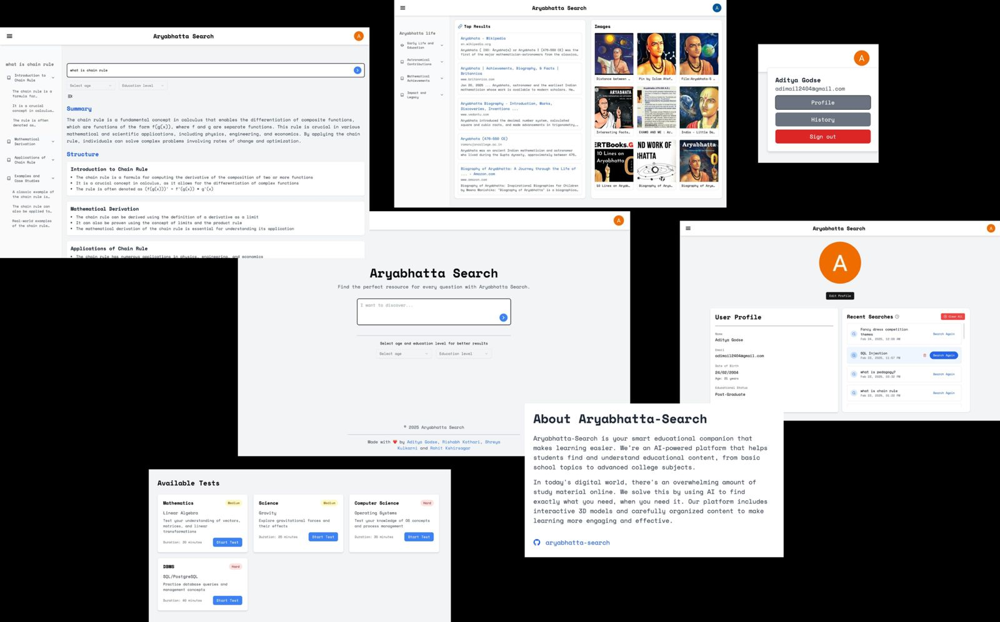
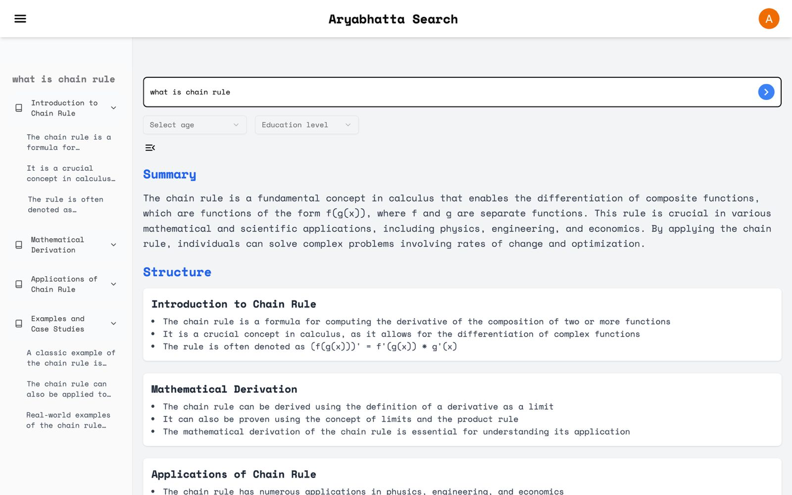
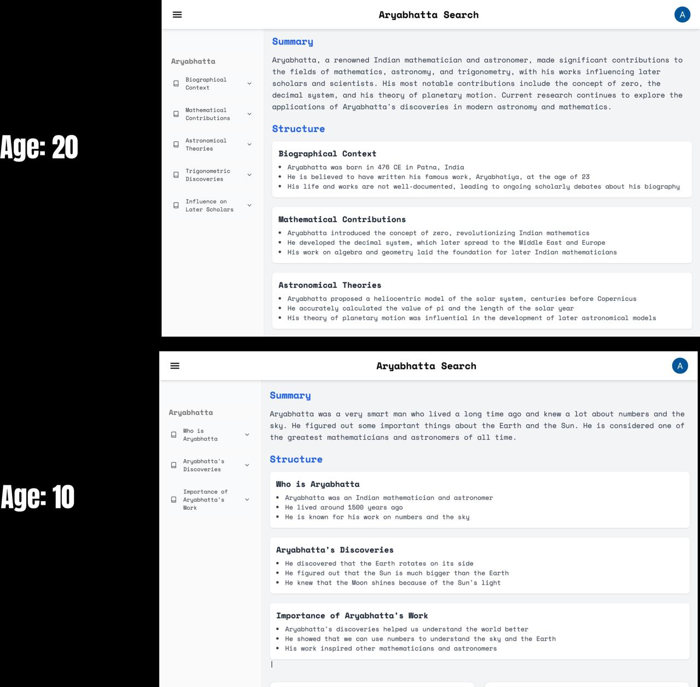
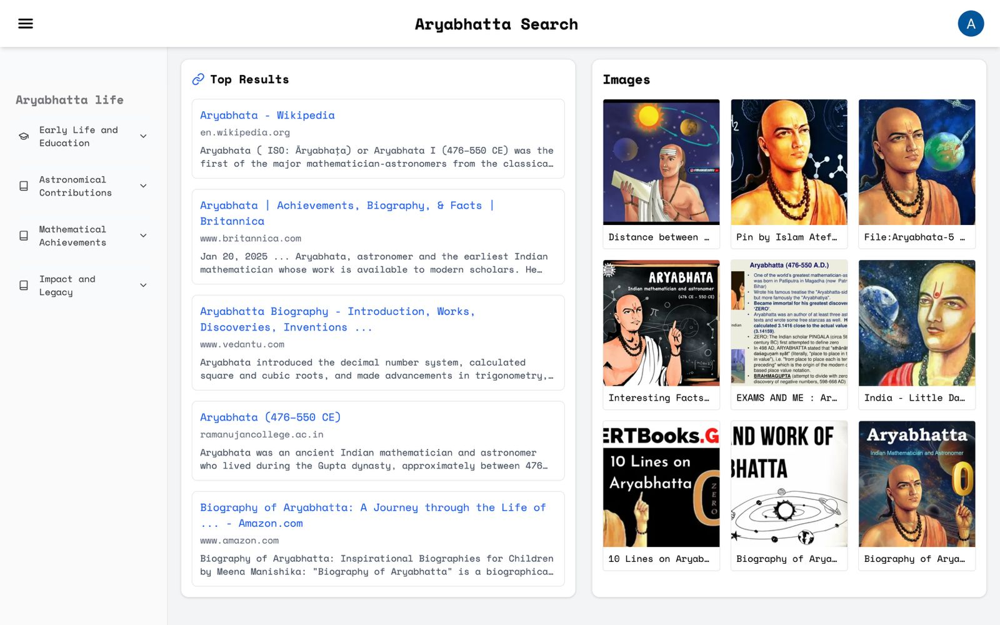
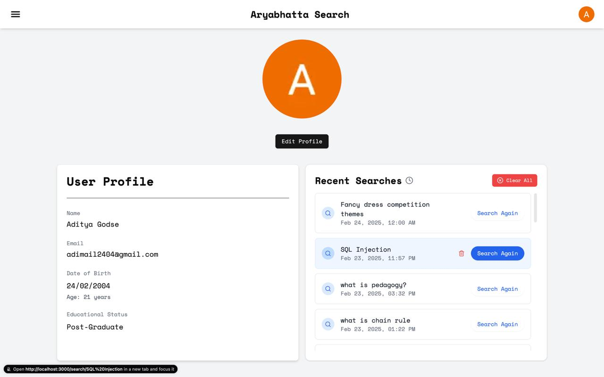
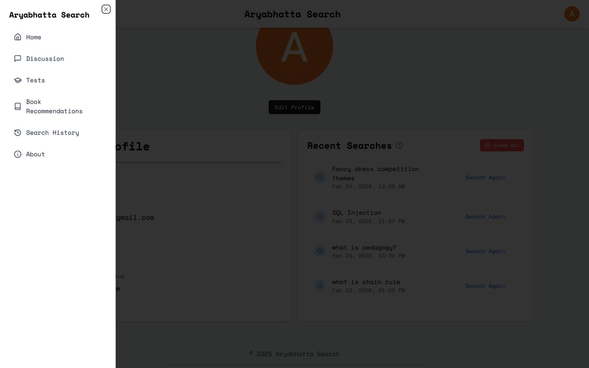
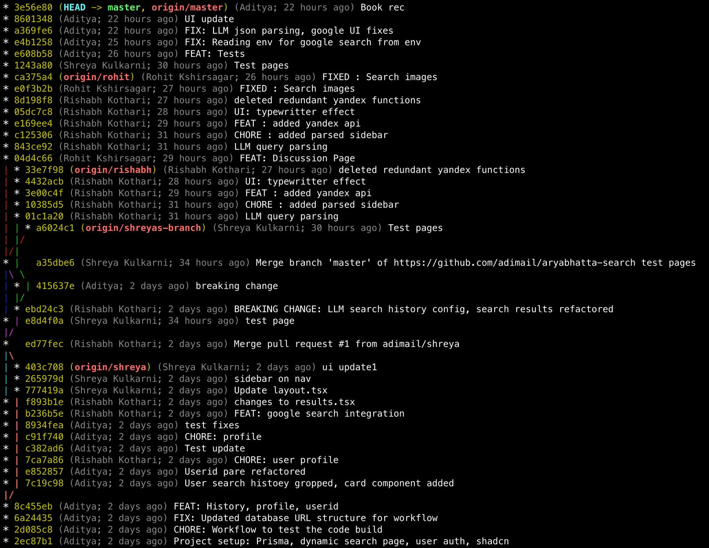

# Aryabhatta Search

Unified Digital Education Platform for Education from Kindergarten to Post-Graduation



## Problem Statement

The digital education space suffers from information overload and lack of relevance. Learners from kindergarten to post-graduation struggle to find organized, age-appropriate content tailored to their needs. Existing platforms are fragmented, making it difficult to discover trusted resources, interactive tools, and community support in one place.

## Solution

Aryabhatta-Search is an AI-powered platform that unifies educational content across all academic levels. It combines a smart search engine, structured content organization, interactive 3D models, and community-driven learning to simplify discovery and enhance understanding.



## Features

- Age and education-level appropriate search results
- Google-powered web search
- LLM-enhanced result summaries
- Book recommendations based on users search history
- Discussion forums
- Parental controls

## Examples



LLM response for a search query "Aryabhatta"

### Age 10, Education Level: 10th Grade

Summary:

Aryabhatta was a very smart man who lived a long time ago and knew a lot about numbers and the sky. He figured out some important things about the Earth and the Sun. He is considered one of the greatest mathematicians and astronomers of all time.

Structure:

- Who is Aryabhatta
- Aryabhatta's Discoveries
- Importance of Aryabhatta's Work

### Age 20, Education Level: Graduate

Summary:

Aryabhatta, a renowned Indian mathematician and astronomer, made significant contributions to the fields of mathematics, astronomy, and trigonometry, with his works influencing later scholars and scientists. His most notable contributions include the concept of zero, the decimal system, and his theory of planetary motion. Current research continues to explore the applications of Aryabhatta's discoveries in modern astronomy and mathematics.

Structure:

- Biographical Context
- Mathematical Contributions
- Astronomical Theories
- Trigonometric Discoveries
- Influence on Later Scholars

### Search results from search engine



Search results from search engine for the query "Aryabhatta" which includes links to the wikipedia page, articles, images and videos.

### User Profile





## Tech Stack

- Next.js 14 (App Router)
- TypeScript
- Tailwind CSS
- Prisma (ORM)
- Supabase (Database)
- NextAuth.js (Authentication)
- Groq (LLM)
- Google Custom Search API

## Prerequisites

- Node.js 18+
- npm/pnpm
- A Supabase account
- A Google Cloud account
- A Groq API account

## Setup Instructions

1. Clone the repository

```bash
git clone https://github.com/adimail/aryabhatta-search.git
cd aryabhatta-search
```

2. Install dependencies

```bash
npm install
```

3. Set up environment variables

```bash
cp .env.example .env
```

4. Configure the following services and add their credentials to your `.env`:

### Supabase Setup

1. Create a new project at [supabase.com](https://supabase.com)
2. Go to Project Settings > API
3. Copy these values to your `.env`:
   - `NEXT_PUBLIC_SUPABASE_URL`: Your project URL
   - `NEXT_PUBLIC_SUPABASE_ANON_KEY`: Your public anon key
   - `SUPABASE_SERVICE_ROLE_KEY`: Your service role key
   - `DATABASE_URL`: Your connection string with pooling
   - `DIRECT_URL`: Your direct connection string

### Google OAuth Setup

1. Go to [Google Cloud Console](https://console.cloud.google.com)
2. Create a new project
3. Enable the OAuth 2.0 API
4. Create credentials (OAuth client ID)
5. Add authorized redirect URIs:
   - `http://localhost:3000/api/auth/callback/google` (development)
   - `https://your-domain.com/api/auth/callback/google` (production)
6. Copy these to your `.env`:
   - `GOOGLE_CLIENT_ID`
   - `GOOGLE_CLIENT_SECRET`

### Google Custom Search Setup

1. Go to [Programmable Search Engine](https://programmablesearchengine.google.com)
2. Create a new search engine
3. Get your Search Engine ID
4. Go to [Google Cloud Console](https://console.cloud.google.com)
5. Enable Custom Search API
6. Create API credentials
7. Add to `.env`:
   - `GOOGLE_SEARCH_API_KEY`
   - `GOOGLE_SEARCH_CSE_ID`

### Groq API Setup

1. Sign up at [groq.com](https://groq.com)
2. Generate an API key
3. Add to `.env`:
   - `GROQ_API_KEY`

The LLM model is set to `llama-3.3-70b-specdec` by default. You can change it to `llama-3.3-70b-chat` or any other model supported by Groq. the config file is in `src/server/config.ts`

4. Initialize the database

```bash
npx prisma db push
```

1. Start the development server

```bash
npm run dev
```

The app should now be running at [http://localhost:3000](http://localhost:3000)

## Contributing

Contributions are welcome! Please feel free to submit a Pull Request.

## Credits

This project was built by [Aditya Godse](https://github.com/adimail), [Rishabh Kothari](https://github.com/RishabhK103), [Shreya Kulkarni](https://github.com/Shreyakulkarni132) and [Rohit Kshirsagar](https://github.com/rohitkshirsagar19) as a part of a 24 hour hackathon.

